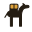
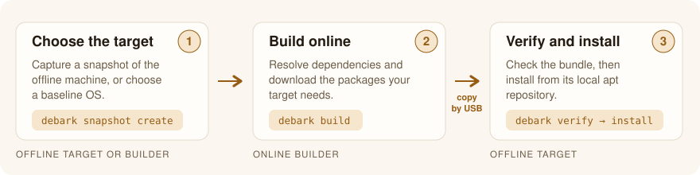
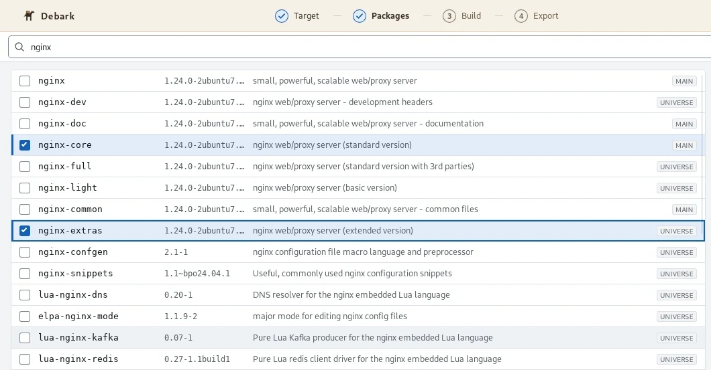

<div align="center">

<a href="https://debark.dev">
  <picture>
    <source media="(prefers-color-scheme: dark)" srcset="docs/assets/logo-mark-dark.svg">
    
  </picture>
</a>

<h1>Debark</h1>

<p><strong>Prepare Debian and Ubuntu packages online. Install them offline.</strong></p>

<p>
  <a href="https://github.com/inferops/debark/actions/workflows/ci.yml"></a>
  <a href="https://github.com/inferops/debark/releases/latest"></a>
  <a href="go.mod"></a>
  <a href="LICENSE"></a>
  <a href="https://debark.dev/docs"></a>
</p>

<p>
  <a href="https://debark.dev"><b>Website</b></a> ·
  <a href="#quick-start"><b>Get started</b></a> ·
  <a href="https://github.com/inferops/debark/releases"><b>Downloads</b></a> ·
  <a href="https://debark.dev/docs"><b>Documentation</b></a> ·
  <a href="CONTRIBUTING.md"><b>Contributing</b></a> ·
  <a href="SUPPORT.md"><b>Get help</b></a>
</p>

</div>

---

debark builds portable bundles of `.deb` packages and their dependencies for
machines without internet access. It resolves packages against a snapshot of
the target machine, or a selected baseline OS, using the target release's apt.
Each bundle includes an apt repository, an exact-version install plan, and an
optional signature that the offline machine verifies before installation.

Use the **CLI** for terminals, scripts, and CI, or the **[Debark desktop
app](gui/README.md)** to browse packages and prepare bundles on the online machine.

> [!IMPORTANT]
> **Pre-1.0.** debark is under active development. Minor releases may include
> breaking changes; published data formats have their own compatibility rules.
> Check [platform support](#platform-support), [known limitations](docs/status.md),
> and the [changelog](CHANGELOG.md) before adopting it.

### Contents

| Get started | Understand it | Project |
| --- | --- | --- |
| [Install](#install) | [Why debark?](#why-debark) | [Platform support](#platform-support) |
| [Quick start](#quick-start) | [How it works](#how-it-works) | [Status and known gaps](#status-and-known-gaps) |
| [Interactive CLI](#use-the-interactive-cli) | [What a bundle contains](#what-a-bundle-contains) | [Documentation](#documentation) |
| [Desktop app](#desktop-app) | [Security model](docs/security-model.md) | [Contributing and support](#contributing-and-support) |

## Why debark?

Running `apt-get install --download-only` on an online machine uses that
machine's installed packages. Dependencies it already has may be missing on
your offline target.

debark gives apt the **target's package state**, so the download plan accounts
for what the target actually needs.

| Capability | What it gives you |
| --- | --- |
| **Target-accurate resolution** | apt resolves against a snapshot of the target, or a selected baseline OS — not against the builder. |
| **Vendor packages** | Combine archive packages, local `.deb` files, and vendor URLs; apt resolves their dependencies together. |
| **Locked versions** | Record the selected versions and install from that plan. |
| **Bundle verification** | Sign with an operator key, and check signatures and file digests before installation. |
| **Incremental builds** | Reuse downloaded content and refresh existing bundles. |
| **Inspection and automation** | Inspect plans, preview target changes, generate an optional CycloneDX SBOM, and consume JSON output. |

No telemetry, analytics, crash uploads, or update checks. Online builds contact
the package sources, vendor URLs, and container registries needed for the request.

## How it works

<picture>
  <source media="(prefers-color-scheme: dark)" srcset="docs/assets/how-it-works-dark.svg">
  
</picture>

1. **Choose the target:** capture it with `debark snapshot create` and copy the
   snapshot to the online builder, or select a baseline OS with `build --base`.
2. **Build online:** `debark build` resolves dependencies and downloads the
   required packages. Add `--sign` to sign the bundle, then copy the entire
   bundle directory to the offline machine.
3. **Install offline:** run `debark verify`, then `debark install` to install
   from the bundle's local apt repository.

A captured snapshot includes the target's installed packages, repositories,
pins, and apt settings. If you cannot capture the machine first,
`build --base` uses a baseline OS instead. A baseline **assumes** an installed
package set; review differences on the target before installing.

See the [illustrated walkthrough](https://debark.dev/how-it-works) or follow the
[quick start](#quick-start) below for complete commands.

## Install

### Linux, with the install script

The script detects amd64 or arm64, downloads the matching release, checks its
published SHA-256, and installs into `$HOME/.local/bin` without sudo:

```sh
curl -fsSL https://debark.dev/install.sh | sh
export PATH="$HOME/.local/bin:$PATH"
debark version
```

Prefer to read it first? Download it, review it, then run it with `--version`
to pin a release; `--help` lists the options. See
[installation](https://debark.dev/docs/get-started/installation) for the full
sequence, and [release downloads](https://debark.dev/docs/trust/release-downloads)
for publisher-signature verification.

### From a release archive

Download the CLI for your machine from
[GitHub Releases](https://github.com/inferops/debark/releases):

| Platform | CLI archive | Other packages |
| --- | --- | --- |
| Linux amd64 | `debark_<version>_linux_amd64.tar.gz` | `.deb`, `.rpm` |
| Linux arm64 | `debark_<version>_linux_arm64.tar.gz` | `.deb`, `.rpm` |
| Windows amd64 | `debark_<version>_windows_amd64.zip` | — |

Extract the archive and put `debark` (or `debark.exe`) on your `PATH`.
CLI downloads use `debark_checksums.txt`; desktop downloads use
`debark-gui_checksums.txt`. Use the matching checksum file and its signature,
as described in the release notes.

### With Go

With **Go 1.26.8 or newer**, you can install the CLI directly:

```sh
go install github.com/inferops/debark/cmd/debark@latest
debark version
```

Go installs executables into `GOBIN`, or `$(go env GOPATH)/bin` when
`GOBIN` is unset. Add that directory to your `PATH` if needed. Use a specific
tag in place of `@latest` when you need a pinned version.

<details>
<summary><b>Build from source</b></summary>

<br>

```sh
git clone https://github.com/inferops/debark.git
cd debark
go build -o debark ./cmd/debark
```

On Windows, use `-o debark.exe`. The CLI is pure Go and needs no GUI libraries.

</details>

### What each machine needs

| Machine | Requirements |
| --- | --- |
| **Online builder** | A compatible local apt, or Docker/Podman running Linux containers. Windows and macOS builders also need a Linux debark binary for the container — see [builder setup](docs/platforms.md#container-builders). |
| **Offline target** | A Linux debark binary, apt/dpkg, and root privileges for installation. Snapshot capture and verification do not need root. |

For the desktop app, follow [desktop installation and build instructions](gui/README.md).
Its platform requirements differ from the CLI's.

## Quick start

Install `jq` on a Debian or Ubuntu machine without internet access. There are
two decisions, and they are independent:

| Decision | Option A | Option B |
| --- | --- | --- |
| **Target** | `--snapshot` — resolve against the real machine *(recommended)* | `--base` — resolve against a baseline OS |
| **Signing** | `--sign operator.key` — authenticate who built the bundle | `--no-sign` — integrity checks only |

The work is split across two machines:

| Machine | What happens there |
| --- | --- |
| **Online builder** | Prepare the bundle: resolve dependencies, download packages, and optionally sign. |
| **Offline target** | Capture a snapshot if using one; later verify and install the bundle. |

Install debark on both machines and check [what each machine
needs](#what-each-machine-needs). Commands below use a POSIX shell with debark
on `PATH`. Replace `jq` with your package names, and run only the options you choose.

### 1. Choose a snapshot or a baseline

**Option A — snapshot of the actual target (recommended when accessible).**
Run on the **offline target**:

```sh
debark snapshot create --out target.snapshot.tar.zst
```

Copy `target.snapshot.tar.zst` **from the offline target to the online builder**
using USB or another transfer method. The snapshot records the target's package
state and apt configuration. It can contain sensitive information; see
[snapshot privacy](docs/faq.md#what-information-is-in-a-snapshot) and `--redact`.

**Option B — baseline OS, with no snapshot capture.** On the **online builder**,
list the available baselines:

```sh
debark snapshot list-bases
```

Choose the offline target's release, variant, and architecture. The example
below uses `ubuntu:24.04/minimal` and `amd64`; change these to match your target.
Variants such as `minimal`, `server`, and `desktop` describe packages
**assumed to be installed already**. They do not install an OS. Review
[baseline validation limits](docs/status.md#baseline-os-builds).

### 2. Choose whether to sign (online builder)

**Unsigned:** no key setup is needed. Keep `--no-sign` in the build command
below. Verification still checks file integrity against the manifest, but
does not authenticate who created the bundle.

**Signed (optional):** create a key on the **online builder** before building:

```sh
debark keygen --out operator.key
```

This creates `operator.key` (private) and `operator.pub` (public). Keep the
private key on the builder. Provision the public key on the offline target
through a trusted channel, or authenticate it using a fingerprint obtained
independently of the bundle media.

In your chosen build command below, **replace `--no-sign` with
`--sign operator.key`**. Use an existing key if you already have one.

### 3. Build the bundle (online builder)

Run **one** of these commands on the **online builder**, from the directory
containing any snapshot and signing key you are using.

**With the snapshot from option A:**

```sh
debark build --snapshot target.snapshot.tar.zst \
  --out ./bundle --no-sign jq
```

**With the baseline from option B:**

```sh
debark build --base ubuntu:24.04/minimal --arch amd64 \
  --out ./bundle --no-sign jq
```

Use either `--snapshot` or `--base`, and either `--no-sign` or `--sign`.
Both workflows produce the same kind of portable bundle.

### 4. Transfer the bundle (online → offline)

After a successful build, copy the **entire `bundle` directory** from the
online builder to the offline target, including all its files and subdirectories.
Use USB or another transfer method. If debark is not already on the target,
include a trusted Linux CLI binary matching its architecture, or use
[`--embed-binary`](docs/quickstart.md#carry-the-cli-in-the-bundle) when building.

### 5. Verify and install (offline target)

Run from the directory containing the transferred `bundle` on the **offline
target**. Use the commands matching your signing choice; these work for both
snapshot and baseline bundles.

**For an unsigned bundle:**

```sh
debark verify ./bundle --allow-unsigned
debark install ./bundle --allow-unsigned --status
# Review the status output before installing:
sudo debark install ./bundle --allow-unsigned --yes
```

**For a signed bundle**, with the trusted `operator.pub` in the current directory:

```sh
debark verify ./bundle --key operator.pub
debark install ./bundle --key operator.pub --status
# Review the status output before installing:
sudo debark install ./bundle --key operator.pub --yes
```

`--status` previews changes without installing. For a baseline build, check
for missing assumed packages; capture the real target and rebuild if the
baseline does not fit. `install` verifies the bundle again before invoking apt
and installs the locked versions. Only the installation command needs root.

See the [full signed-bundle walkthrough](docs/quickstart.md) for more detail,
vendor packages, updates, and transfer options.

### Use the interactive CLI

Run on the **online builder**:

```sh
debark build --interactive
```

The prompts cover the target, package list, output, optional signing, upgrades,
and SBOM. The CLI saves entered packages to a list file and prints a command to
reuse. Interactive mode requires a terminal. Then follow steps 4 and 5 above.

## What a bundle contains

A bundle is an ordinary flat apt repository, plus the files that record what is
on the media and prove it arrived intact. `bundle export --tar` produces the
identical tree inside a deterministic `<name>.debark.tar.zst`.

```text
bundle/
├── repo/                          a flat apt repository apt can read directly
│   ├── Release                      apt release file
│   ├── Packages, Packages.gz        apt package indices
│   └── pool/<p>/<pkg>/*.deb         the packages themselves
├── debark.manifest.json           every file, with size and sha256 — the signed document
├── debark.manifest.sig            detached operator signature (signed bundles only)
├── lock.json                      the exact versions install works from
├── snapshot.json                  the target this bundle was built for
├── evidence.json                  structured build events
├── last-run-added.txt             pool files this run added
├── last-run-removed.txt           pool files this run pruned (empty unless --update)
├── last-run-unreferenced.txt      pool files repo/Packages does not index
├── README.txt                     human summary and verify/install instructions
├── sbom.cdx.json                  optional, --sbom (CycloneDX)
└── bin/debark-linux-<arch>        optional, --embed-binary
```

`debark verify` reads the manifest and signature and checks every digest before
apt sees the repository; `debark install` then works from the lock. Because
`repo/` is a plain apt repository, the packages stay installable by hand.

Full field-level reference: [formats](docs/formats.md#2-bundle-layout) ·
[JSON Schemas](api/schema/) ·
[bundle format](https://debark.dev/docs/reference/bundle-format).

## Desktop app

<a href="https://debark.dev/docs/get-started/desktop">
  
</a>

The [Debark desktop app](gui/README.md) runs on the **online builder**. It walks
through the same workflow as the CLI — choose a target, browse and select
packages, build, and export the bundle to a folder or USB drive — and delegates
builds and verification to the CLI. The offline target still uses the CLI to
verify and install.

Desktop packages are published for Linux amd64 on Ubuntu 24.04/26.04 and
Debian 13. See the [desktop guide](https://debark.dev/docs/get-started/desktop)
and the [desktop user guide](gui/docs/user-guide.md).

## Platform support

| Role | Supported path |
| --- | --- |
| Capture and install on a target | Debian 12/13 and Ubuntu 22.04/24.04/26.04; Linux with apt/dpkg |
| Build on Linux | Compatible local apt, otherwise a Linux container |
| Build on Windows | Docker or Podman with Linux containers and a Linux debark helper |
| Verify and inspect | Linux and Windows CLI binaries; portable Go code |
| Desktop builder | Linux amd64 on Ubuntu 24.04/26.04 and Debian 13 |

CLI binaries are released for Linux amd64/arm64 and Windows amd64. The nightly
integration workflow covers amd64; arm64 integration requires a manual run
with emulation enabled. macOS is a source-build path without CI or recorded
container validation. Derivative distributions are best effort.

See [platforms and prerequisites](docs/platforms.md) for baseline IDs,
container setup, and the distinction between available builds and tested paths.

## Status and known gaps

The captured-snapshot workflow has an end-to-end demo that installs packages
with networking disabled. Baseline builds, cross-platform container builds,
and the desktop app have different levels of validation. These are recorded
in [status and known limitations](docs/status.md), with links to the underlying
tests and reports.

> [!NOTE]
> A valid signature establishes who signed a bundle and whether its contents
> changed. Packages can still contain vulnerabilities or maintainer scripts
> that require the network. See the [security model](docs/security-model.md).

## Documentation

Browse the [online documentation](https://debark.dev/docs) for guides and
reference pages. The [repository documentation](docs/README.md) follows the
source in this checkout and can be read offline; use a release tag for the
docs that shipped with that version.

| I want to… | Online guide | Repository reference |
| --- | --- | --- |
| Build and install my first bundle | [Quick start](https://debark.dev/docs/get-started/quickstart) | [Quick start](docs/quickstart.md) |
| Find flags, package inputs, JSON output, or exit codes | [CLI reference](https://debark.dev/docs/reference/cli) | [CLI guide](docs/cli.md) |
| Set up Windows, containers, or a different target release | [Supported systems](https://debark.dev/docs/get-started/supported-systems) | [Platforms](docs/platforms.md) |
| Browse packages in the desktop app | [Desktop guide](https://debark.dev/docs/get-started/desktop) | [Desktop user guide](gui/docs/user-guide.md) |
| Diagnose a failure | [Troubleshooting](https://debark.dev/docs/operate/troubleshooting) | [Troubleshooting](docs/troubleshooting.md) |
| Understand snapshots, baselines, and trust | [How verification works](https://debark.dev/docs/trust/trust-model) | [FAQ](docs/faq.md) · [Security model](docs/security-model.md) |
| Read or integrate the file formats | [Bundle format](https://debark.dev/docs/reference/bundle-format) | [Formats](docs/formats.md) · [Schemas](api/schema/) |
| Find design decisions and validation reports | — | [Documentation index](docs/README.md) |

## Contributing and support

Contributions to code, documentation, tests, accessibility, and packaging are
welcome. Create a branch, make signed-off commits, and open a pull request
targeting `main`. Required checks must pass before a maintainer merges it;
maintainers use the same PR workflow. [CONTRIBUTING.md](CONTRIBUTING.md) walks
through fork setup, local checks, opening a PR, and updating it during review.
Commits require a [DCO sign-off](DCO); there is no CLA.

| I want to… | Go to |
| --- | --- |
| Report a bug or ask a question | [GitHub Issues](https://github.com/inferops/debark/issues) · [SUPPORT.md](SUPPORT.md) explains what to include |
| Report a vulnerability privately | [SECURITY.md](SECURITY.md) |
| Open my first pull request | [CONTRIBUTING.md](CONTRIBUTING.md) |
| Understand project decisions and scope | [GOVERNANCE.md](GOVERNANCE.md) |

Participation follows the [Code of Conduct](CODE_OF_CONDUCT.md).

## License

Apache-2.0. See [LICENSE](LICENSE), [NOTICE](NOTICE), and the
[trademark policy](TRADEMARK.md).

The CLI, desktop app, and capabilities needed to prepare, inspect, transfer,
verify, and install a bundle are community functionality. The
[free/paid policy](docs/free-paid-policy.md) records that commitment.

<div align="center">
<br>
<a href="https://debark.dev">debark.dev</a> · built by <a href="https://inferops.com">InferOps</a>
</div>
